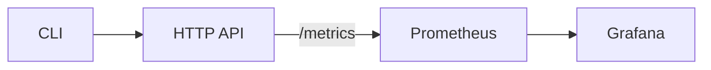

# Architecture

The project combines a command-line interface with an HTTP API and observability stack.

- **CLI** – runs analyses locally or sends requests to the API.
- **HTTP API** – exposes `/run`, `/validate`, `/metrics`, and `/healthz` endpoints.
- **Prometheus** – scrapes the API's `/metrics` endpoint.
- **Grafana** – visualizes metrics collected by Prometheus.
